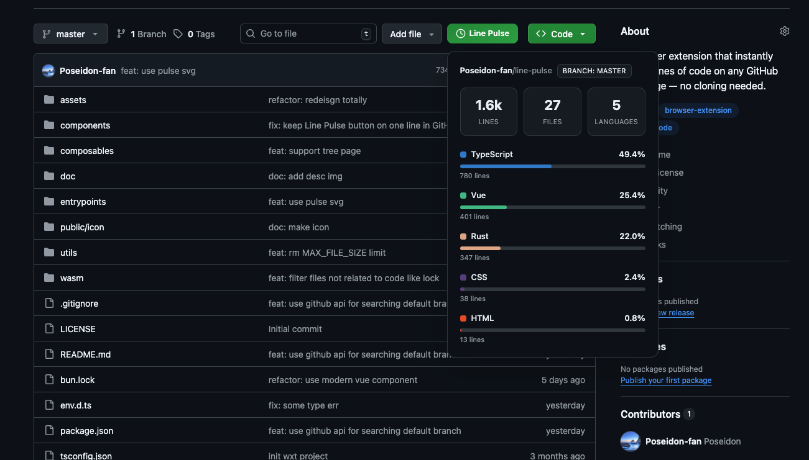

<p align="center">
  
</p>

<h1 align="center">Line Pulse ⚡</h1>

<p align="center">
  <a href="https://github.com/Poseidon-fan/line-pulse/stargazers">
    
  </a>
  <a href="https://github.com/Poseidon-fan/line-pulse/issues">
    
  </a>
  <a href="https://github.com/Poseidon-fan/line-pulse/blob/master/LICENSE">
    
  </a>
</p>

> A lightning-fast GitHub repository code statistics browser extension.

<p align="center">
  
</p>

## The Problem

Sometimes you just want to quickly know the size of a GitHub repository — how many lines of code, what languages are used, and the overall codebase scale. Normally, this requires:

1. Cloning the repository locally
2. Installing tools like `cloc`, `tokei`, or `sloc`
3. Running the analysis
4. Cleaning up the local clone

**Line Pulse** solves this. With a single click on any GitHub repository page, you get instant code statistics directly in your browser.

## Features

- ⚡ **One-click Analysis** — Click the button on any GitHub repo, get instant results
- 🎨 **Language Breakdown** — Color-coded statistics for each programming language
- 🌙 **Dark Mode** — Seamlessly adapts to your system theme
- 🔒 **Private & Local** — All analysis runs locally in your browser. No data sent to any server
- 🚀 **Powered by Rust** — High-performance WASM-based code analysis engine

## Usage

1. Visit any public GitHub repository
2. Click the **Line Pulse** button next to the Code button
3. View instant code statistics:
   - Total lines of code
   - Number of files
   - Language distribution with percentages

## Development

### Prerequisites

- [Rust](https://rust-lang.org/tools/install/) — For building the WASM analysis engine
- [Bun](https://bun.com/) — Fast JavaScript runtime and package manager

### Quick Start

```bash
# Install WASM toolchain (first time only)
cargo install wasm-pack

# Install dependencies
bun install

# Run in dev mode
bun run dev
```

### Building for Production

```bash
# Build for Chrome
bun run build

# Build for Firefox
bun run build:firefox
```

`bun run dev` / `bun run build` will automatically generate the WASM bundle into `wasm/pkg`.

## Tech Stack

| Layer | Technology |
|-------|------------|
| Extension Framework | [WXT](https://wxt.dev/) |
| UI | Vue 3 + TypeScript |
| Analysis Engine | Rust (WASM) |
| ZIP Processing | [fflate](https://github.com/101arrowz/fflate) |

## License

MIT License — see [LICENSE](LICENSE) for details.
